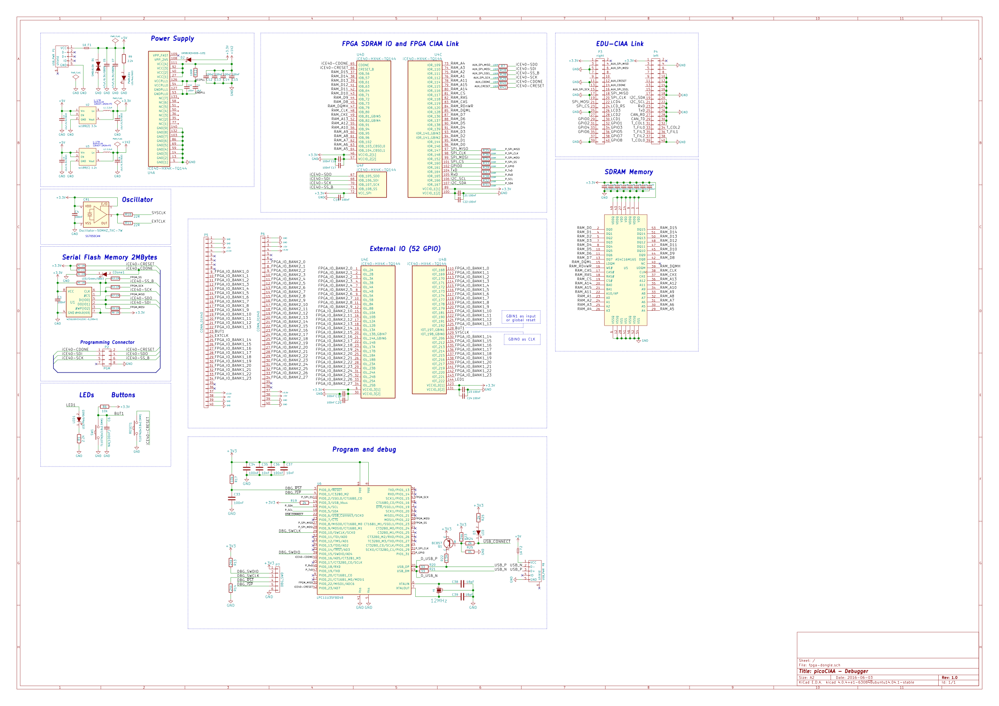

# FPGA Poncho para EDU CIAA

Poncho FPGA basado en la placa [Olimex iCE40HX1K-EVB](https://www.olimex.com/Products/FPGA/iCE40/iCE40HX1K-EVB/open-source-hardware)

> Licencia Apache 2.0 relicenciable a CIAA 1.0

## Caracteristicas
  - FPGA iCE40HX1K soportada por el proyecto IceStorm
  - 8-64MB de SDRAM
  - 64Mb SPI flash
  - Oscilador 100MHz on board
  - 8 salidas LVDS o 18 salidas single ended mas clock

## Lista de tareas
  - [x] Esqematico preeliminar
  - [ ] Revision del esquematico
  - [ ] Asignado de footprints
  - [ ] Place and route
  - [ ] Archivos de fabricacion

## Schematic

